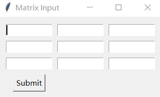
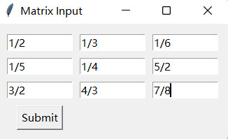
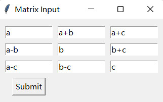

Matrix:  一个线性代数包
==================================================

Author: Colin Doo(杜瑾鸿)

Date: 2024/10/30

注：仅供ChenLab学生学习参考。本包目前用纯Python语言编写，然而未来可能将用C/C++、Cython或Fortran实现一部分较慢的运算。


## 输入矩阵

本文档假设读者具有线性代数的基础，可以理解矩阵的基础运算。

在本包中，matrix被定义为**元组**(tuple)的一个子类，可以像列表/元组那样迭代。

```python
>>> mtr = matrix([[1, 2, 3], [4, 5, 6], [7, 8, 9]])
>>> print(*mtr, sep='\n')
[1, 2, 3]
[4, 5, 6]
[7, 8, 9]
```

创建一个**matrix对象**的方法有许多种。其中\_\_new\_\_提供直接的3种：

- 直接创建(direct build)：输入一个类似矩阵的二阶列表；
- 拼接创建(joint build)：输入几个等长的含有数据的列表；
- 解析创建(specification build)：直接输入数据，然后使用参数告诉matrix，应该怎么排列这些数据。

请看下面的示例：

```python
>>> from Matrix import matrix
>>>
>>> mtr = matrix([[1, 0, 0], [0, 1, 0], [0, 0, 1]]) # Direct build
>>> mtr
╭ 1  0  0 ╮
│ 0  1  0 │
╰ 0  0  1 ╯
>>>
>>> matrix([1, 2, 3], [0, 9, 5], [3, 1, 6]) # Joint build
╭ 1  2  3 ╮
│ 0  9  5 │
╰ 3  1  6 ╯
>>> matrix([1, 2, 3], [0, 9, 5], [3, 1, 6], as_column=True)
╭ 1  0  3 ╮
│ 2  9  1 │
╰ 3  5  6 ╯
>>>
```

解析创建中可使用的关键字参数包括：

* `rn`，行数，生成的矩阵将含有`rn`行；
* `cn`，列数，如果没有指定，会根据数值的个数和`rn`推算，`rn`同理；
* `fill`, 填充值（如果数据少于预期的数量，譬如rn=3, cn=4，而只输入了10个数字）；
* `horizontal` 或 `as_row`，横向排列（默认）；
* `vertical` 或 `as_column`，纵向排列，与horizontal/as_row不能同时为True，否则会报错；
* `reverse`，颠倒排列顺序。
* `as_diag`，转化为对角矩阵，其中输入的值作为对角元；
* `repeat`，将某个数值或者某个行向量重复多次。

例如：

```python
>>> a = matrix(1,2,3,4,5,6,7,8,9, rn=3)
>>> a
╭ 1  2  3 ╮
│ 4  5  6 │
╰ 7  8  9 ╯
>>> a = matrix(*range(9), rn=5, cn=2, fill=-1)
>>> a
╭ 0   1 ╮
│ 2   3 │
│ 4   5 │
│ 6   7 │
╰ 8  -1 ╯
>>> matrix(1, repeat=5, as_diag=True, rn=6, cn=6, fill=-1)
╭ 1  0  0  0  0   0 ╮
│ 0  1  0  0  0   0 │
│ 0  0  1  0  0   0 │
│ 0  0  0  1  0   0 │
│ 0  0  0  0  1   0 │
╰ 0  0  0  0  0  -1 ╯
```

也可以使用类方法`matrix.input`来输入一个矩阵。该方法会打开一个表格窗口，用户可以在窗口中输入数据，确定后提交，获得一个矩阵。

	>>> mtr = matrix.input(3, 3)

产生的输入窗口如下：



输入的内容实际上是文本，然后才被转化为数据类型。可通过参数`dtype`来指定。比如我想输入一个分数矩阵，可执行如下操作：

```python
>>> from fractions import Fraction as f
>>> # "fractions" is a built-in package from python
>>> mtr = matrix.input(3, 3, dtype=f)

```

输入：



```python
>>> mtr
╭ 1/2  1/3  1/6 ╮
│ 1/5  1/4  5/2 │
╰ 3/2  4/3  7/8 ╯
>>> 
>>> mtr.d
Fraction(-221, 576)
>>> 
>>> mtr.inv
╭  138/17    40/221   -456/221 ╮
│ -792/85  -108/221  3504/1105 │
╰   24/85    96/221  -168/1105 ╯
>>> 
>>> mtr**2
╭   17/30   17/36    17/16 ╮
│   39/10  277/80  683/240 │
╰ 559/240       2  835/192 ╯
```

利用Python中的`fractions.Fraction`和`decimal.Decimal`可以避免常规浮点数的精度危机。事实上，dtype可以是将文本转化为数据的任意函数。比如`eval`：

```python
>>> a, b, c = f('1/2'), 1, 2
>>> mtr = matrix.input(3, 3, eval)

```



```python
>>> mtr
╭  1/2  3/2  5/2 ╮
│ -1/2    1    3 │
╰ -3/2   -1    2 ╯
```

另外，matrix类提供了缓存功能，如果类属性`matrix.cache=True`，对于用户没有命名的矩阵（特别是随机生成的矩阵，或者花了很长时间输入的矩阵），可使用类方法`matrix.last()`将其调出。

```python
>>> matrix.cache=True
>>> rand(4)
╭ 8  1  9  3 ╮
│ 5  5  9  6 │
│ 7  1  0  8 │
╰ 0  4  7  0 ╯
>>> a=matrix.last()
>>> a
╭ 8  1  9  3 ╮
│ 5  5  9  6 │
│ 7  1  0  8 │
╰ 0  4  7  0 ╯
```

本包也提供了从字符串创建矩阵的方法`matrix.from_str`（这个方法会读取本包用于展示矩阵的字符串，即`str(a)`）和从csv文件创建矩阵的方法`matrix.from_csv`. 

```python
>>> a=rand(4)
>>> a
╭ 0  4  4  0 ╮
│ 3  4  2  9 │
│ 4  5  5  2 │
╰ 0  7  3  3 ╯
>>> str(a)
'╭ 0  4  4  0 ╮\n│ 3  4  2  9 │\n│ 4  5  5  2 │\n╰ 0  7  3  3 ╯'
>>> matrix.from_str(str(a))
╭ 0  4  4  0 ╮
│ 3  4  2  9 │
│ 4  5  5  2 │
╰ 0  7  3  3 ╯
>>> 
```

此外，也可以复制`str(a)`，然后粘贴到`matrix.input`的窗格中（通过快捷键“Ctrl-v”或“Insert”），即可以轻松快速地复制所输入的矩阵。

## 执行矩阵运算

为了进行示例，先输入两个矩阵：

```python
>>> a = matrix.input()
>>> a
╭ 1  2  3 ╮
│ 2  2  1 │
╰ 3  4  3 ╯
>>> b = matrix(*range(9), rn=3, reverse=True, vertical=True)
>>> b
╭ 8  5  2 ╮
│ 7  4  1 │
╰ 6  3  0 ╯
```

四则运算：加(`+`)、减(`-`)、乘(`*`)、除(`/`)；以及转置(`mtr.t`)、行列式(`.d`)、逆矩阵(`.inv`)、幂(`**`)：

```python
>>> a + b 
╭ 9  7  5 ╮
│ 9  6  2 │
╰ 9  7  3 ╯
>>> a + 1 # A matrix plus a number is also valid, add this number to every entry.
╭ 2  3  4 ╮
│ 3  3  2 │
╰ 4  5  4 ╯
>>> a - b
╭ -7  -3  1 ╮
│ -5  -2  0 │
╰ -3   1  3 ╯
>>> a*b
╭ 40  22   4 ╮
│ 36  21   6 │
╰ 70  40  10 ╯
>>> a/3
╭ 0.3333333333333333  0.6666666666666666                 1.0 ╮
│ 0.6666666666666666  0.6666666666666666  0.3333333333333333 │
╰                1.0  1.3333333333333333                 1.0 ╯
>>> a.d
2.0
>>> a.inv # is equivalent to a**(-1)
╭  1.0   3.0  -2.0 ╮
│ -1.5  -3.0   2.5 │
╰  1.0   1.0  -1.0 ╯
>>> a**5
╭ 4408  5748  4852 ╮
│ 3138  4092  3454 │
╰ 6592  8596  7256 ╯
```

> [!NOTE]
>
> 为了赋予矩阵以尽可能丰富的运算功能，本包中矩阵加法(`+`)、减法(`-`)、除法(`/`)、取模(`%`)、取整(`//`)（即算术运算）都遵循相同的逻辑：如果另一方是一个数，则对矩阵的所有元都采取关于该数的操作；如果另一方是一个矩阵（必须同型），则对两个矩阵的相应位置的元进行该运算。然而，在标准的矩阵运算中，这样做可能是非法的。

结合`sympy`包，也可以实现代数矩阵及其运算：

```python
>>> from sympy import symbols
>>> a11, a12, a21, a22 = symbols('a₁₁, a₁₂, a₂₁, a₂₂')
>>> 
>>> Aij = matrix([[a11, a12], [a21, a22]])
>>> Aij
╭ a₁₁  a₁₂ ╮
╰ a₂₁  a₂₂ ╯
>>> 
>>> Aij.d
a₁₁*a₂₂ - a₁₂*a₂₁
>>> 
>>> Aij**2
╭  a₁₁**2 + a₁₂*a₂₁  a₁₁*a₁₂ + a₁₂*a₂₂ ╮
╰ a₁₁*a₂₁ + a₂₁*a₂₂   a₁₂*a₂₁ + a₂₂**2 ╯
>>> 
```

### 关于矩阵的积

矩阵的乘法在四则运算中比较特殊，有多种不同的定义方式。其中最基础的类型包括：

- **标准乘法/内积/点积**：即$`{\mathbf C}={\mathbf A}{\mathbf B} =(\sum_k{a_{ik}·b_{kj}})_{ij}`$
- **数乘**：矩阵与一个数之间的乘积，即$`x{\mathbf A}=(xa_{ij})_{ij}`$
- **Hadamard积**（数学符号是ʘ）：即同型矩阵的对应位置的元两两相乘，即$`{\mathbf A}\odot{\mathbf B}=(a_{ij}b_{ij})_{ij}`$

本包利用python中的运算符“*”实现内积、数乘和Hadamard积。

- 若另一方为单个值，执行数乘；
- 若前一矩阵列数与后一矩阵行数相等，执行标准乘法；
- 若两矩阵同型，则执行Hadamard积。

显然，如果矩阵为方阵，则标准乘法和Hadamard积是有冲突的，“*”运算符将优先执行矩阵标准乘法。

对于方阵的Hadamard积，建议使用字面方法（`mtr.hadamard`）。

```python
>>> a, b = rand(5), rand(5) # randomly generate some integer matrices
>>> a
╭ 4  8  8  5  8 ╮
│ 8  8  4  3  4 │
│ 2  0  6  4  5 │
│ 8  4  0  4  2 │
╰ 8  9  7  9  9 ╯
>>> b
╭ 2  3  2  7  3 ╮
│ 6  0  8  8  8 │
│ 0  2  5  9  3 │
│ 5  6  6  0  1 │
╰ 8  5  1  5  9 ╯
>>>
>>> a.hadamard(b)
╭  8  24  16  35  24 ╮
│ 48   0  32  24  32 │
│  0   0  30  36  15 │
│ 40  24   0   0   2 │
╰ 64  45   7  45  81 ╯
```

其他类型的矩阵积及其在本包中实现：

#### Kronecker积/张量积/外积

实际上是把两矩阵的每个元都两两组合，然后在对应位置乘积。一个n×m矩阵与一个p×q矩阵的张量积就是一个np×mq矩阵：

```math
{\mathbf A}\otimes {\mathbf B}=(a_{ij}{\mathbf B})_{ij}=\left( \begin{array}{cc} a_{11}{\mathbf B} & \cdots & a_{1m}{\mathbf B} \\ \vdots & \ddots & \vdots \\ a_{n1}{\mathbf B}  & \cdots & a_{nm}{\mathbf B} \end{array} \right)=\left( \begin{array}{cc} a_{11}b_{11} &\cdots & a_{11}b_{1p}& \cdots & a_{1m}b_{1p} \\ \vdots & \ddots & \vdots & \ddots & \vdots \\ a_{11}b_{q1}  & \cdots & a_{11}b_{qp} & \cdots & a_{1m}b_{qp} \\ \vdots & \ddots & \vdots & \ddots & \vdots \\ a_{n1}b_{q1} & \cdots & a_{n1}b_{q1} & \cdots & a_{nm}b_{qp} \end{array} \right)
```

运算符`@`或字面方法`mtr.kronecker`是Kronecker积的实现。这里援引维基百科中的例子：

```python
>>> a=matrix([[1,2],[3,4]])
>>> b=matrix([[0,5],[6,7]])
>>> a @ b
╭  0   5   0  10 ╮
│  6   7  12  14 │
│  0  15   0  20 │
╰ 18  21  24  28 ╯
```

#### Khatri-Rao积

定义为：

```math
{\mathbf A}\ast{\mathbf B}=({\mathbf A}_{ij}\otimes{\mathbf B}_{ij})_{ij}
```

这是一种不完全的张量积，即先对矩阵分块，再在对应的块之间作张量积。分块方式可以任意，但两矩阵的行块数和列块数都必须相同。

字面方法`mtr.khatri_rao`是Khatri-Rao积的实现。它和Tracy-Singh积一样，都有另外两个参数，用于指定分块方式。

```python
>>> a=matrix(*range(1, 10), rn=3)
>>> b=matrix(*range(1, 10), rn=3, as_column=1)
>>> matrixList([a, b])

┌╭ 1  2  3 ╮  ╭ 1  4  7 ╮┐
││ 4  5  6 │  │ 2  5  8 ││
└╰ 7  8  9 ╯, ╰ 3  6  9 ╯┘

>>> # "matrixList" is a class in this package used to present matrix in list.
>>> # An example in wikipedia "Khatri-Rao product"
>>> a.khatri_rao(b, [[2, 1], [2, 1]], [[1, 2], [1, 2]]) 
╭  1   2  12  21 ╮
│  4   5  24  42 │
│ 14  16  45  72 │
╰ 21  24  54  81 ╯
```

#### Tracy-Singh积

定义为：

```math
{\mathbf A}\circ{\mathbf B}=(({\mathbf A}_{ij}\otimes{\mathbf B}_{kl})_{kl})_{ij}
```

两矩阵的分块方式都任意。其运算方式为：先分块，作关于块的张量积，然后对于张量积中每两个块的组合，再作关于元的张量积。

字面方法`mtr.tracy_singh`是Tracy-Singh积的实现。

```python
>>> # a, b is the same as that in the example of Khatri-Rao product
>>> a.tracy_singh(b, [[2, 1], [2, 1]], [[1, 2], [1, 2]])
╭  1   2   4   7   8  14   3  12  21 ╮
│  4   5  16  28  20  35   6  24  42 │
│  2   4   5   8  10  16   6  15  24 │
│  3   6   6   9  12  18   9  18  27 │
│  8  10  20  32  25  40  12  30  48 │
│ 12  15  24  36  30  45  18  36  54 │
│  7   8  28  49  32  56   9  36  63 │
│ 14  16  35  56  40  64  18  45  72 │
╰ 21  24  42  63  48  72  27  54  81 ╯
```

在Khatri-Rao和Tracy-Singh积中实际上都调用了矩阵分块。该内容将在下文中介绍。

#### 面分割积

实际上是关于行向量的张量积。其定义为：

```math
{\mathbf A}\bullet{\mathbf B}=({\mathbf A}_{i\cdot}\otimes{\mathbf B}_{i\cdot})_{i\cdot}
```

字面方法`mtr.slyusar`或`mtr.face_splitting`是面分割积的实现。

```python
>>> a.slyusar(b)
╭  1   4   7   2   8  14   3  12  21 ╮
│  8  20  32  10  25  40  12  30  48 │
╰ 21  42  63  24  48  72  27  54  81 ╯
```

#### 列式Kronecker积

实际上是关于列向量的张量积。似乎也被称为一种Khatri-Rao积（至少如果你调用R的`Matrix`包中的`KhatriRao`，则其实际执行的就是该积）。其定义为：

```math
{\mathbf A}\diamond{\mathbf B}=({\mathbf A}_{\cdot j}\otimes{\mathbf B}_{\cdot j})_{\cdot j}
```

本包中字面方法`mtr.kronecker_col`是列式张量积的实现。

```python
>>> a.kronecker_col(b)
╭  1   8  21 ╮
│  2  10  24 │
│  3  12  27 │
│  4  20  42 │
│  8  25  48 │
│ 12  30  54 │
│  7  32  63 │
│ 14  40  72 │
╰ 21  48  81 ╯
```

实际上，只需要在Khatri-Rao中使用合适的分块方式，就可以实现任意不完全的Kronecker积：

```python
>>> a.khatri_rao(b, [[3], [1, 1, 1]], [[3], [1,1,1]]) # Column-wise Kronecker product
╭  1   8  21 ╮
│  2  10  24 │
│  3  12  27 │
│  4  20  42 │
│  8  25  48 │
│ 12  30  54 │
│  7  32  63 │
│ 14  40  72 │
╰ 21  48  81 ╯
>>> a.khatri_rao(b, [[1, 1, 1], [3]], [[1, 1, 1], [3]]) # Face-splitting product/Slyusar product
╭  1   4   7   2   8  14   3  12  21 ╮
│  8  20  32  10  25  40  12  30  48 │
╰ 21  42  63  24  48  72  27  54  81 ╯
```

### 关于运算速度

上文提到的一些基础运算中，快速运算（能够在1秒内完成）的矩阵阶数$N$的上限分别为：

- **算术运算和转置**：计算复杂度为$`O(N^2)`$，2000 - 5000阶（400万 - 2500万个元）。（在极高的阶数下，生成一个矩阵都需要一定的时间。）
- **乘法、行列式和逆矩阵**：$`O(N^3)`$，200-500阶（4万 - 25万个元）。本包中，行列式和逆矩阵均用Gauss-Jordan消元法（即使用线性变换将矩阵还原为上三角阵，乃至单位阵）编写。

在本包的子包`methods`（尚未发布）中即将包括的算法有：

- 矩阵乘法的**Strassen算法**，该算法理论上的复杂度为$`O(N^{2.81})`$，然而由于种种原因，其速度反而低于使用python丰富的生成器类实现的标准乘法。
- **Strassen算法的Winograd变体**。计算量稍有减少，但复杂度与Strassen算法相同。
- 矩阵乘法的**Coppersmith-Winograd算法**，理论上可将复杂度降低到$`O(N^{2.37})`$。然而实际操作上可能达不到那么快的速度。
- 行列式的**Laplace展开法**，即将行列式展开为余子式，其计算复杂度为$`O(N!)`$，4阶矩阵以内快于消元法；超过10阶就会花费很长时间。对于一个100阶矩阵，需要作10^157次计算，会导致内存溢出，对于高阶矩阵，极其不推荐使用。（就算一台计算机有逆天的存储能力，面对这样大的计算量，算到宇宙毁灭也算不完！）
- 行列式的**LU分解法**，复杂度仍为$`O(N^3)`$。
- **逆矩阵的标准定义**：其计算复杂度是$`O(N^5)`$，阶数上限为20-50阶左右。

（本包正在计划用C, Numpy或者Cython进行提速，如有需要，请关注未来的更新版本。）

## 对矩阵进行操作

本包也提供了一些运算符和方法来进行针对矩阵本身的操作。

这些方法包括有：

* **列并**(`&`)和**行并**(`|`)，即两个矩阵所有列向量（要求两矩阵列数相等），或者行向量进行合并；
* **左移/上移**`<<`及**右移/下移**`>>`，即所有的列向量向左移动（第一个行向量移动到最右侧），或者所有的行向量向上移动，或相反；
* **行颠反**`reversed`，**列颠反**`~`，即把所有行向量（或列向量）的顺序颠倒；
* **旋转**`mtr.rot`。

以上这些运算符或者方法，此处不再示例，请感兴趣的读者自行尝试。这里主要介绍一下矩阵的分块和合并，以及矩阵的索引。

### 矩阵的分块与合并

分块矩阵是线性代数中最基础的概念之一。

本包提供3种分块方式：按索引分块(`mtr.partition_by_index`)、按行数/列数分块(`mtr.partition`)，以及按块数分块(`mtr.partition_into`)。请看示例：

```python
>>> a=rand(8)
>>> a
╭ 3  0  5  4  4  2  9  5 ╮
│ 2  5  1  2  1  5  6  3 │
│ 6  6  5  2  0  4  9  8 │
│ 3  6  9  0  9  1  7  4 │
│ 0  4  1  8  0  3  4  4 │
│ 3  9  9  2  8  6  5  8 │
│ 2  2  8  5  5  2  7  4 │
╰ 5  9  6  9  3  3  4  5 ╯
>>> # Partition the matrix after 2nd, 5th rows, 1st and 6th columns.
>>> a.partition_by_index([2, 5], [1, 6])  
[
┌╭ 3 ╮  ╭ 0  5  4  4  2 ╮  ╭ 9  5 ╮┐
└╰ 2 ╯, ╰ 5  1  2  1  5 ╯, ╰ 6  3 ╯┘
, 
┌╭ 6 ╮  ╭ 6  5  2  0  4 ╮  ╭ 9  8 ╮┐
││ 3 │  │ 6  9  0  9  1 │  │ 7  4 ││
└╰ 0 ╯, ╰ 4  1  8  0  3 ╯, ╰ 4  4 ╯┘
, 
┌╭ 3 ╮  ╭ 9  9  2  8  6 ╮  ╭ 5  8 ╮┐
││ 2 │  │ 2  8  5  5  2 │  │ 7  4 ││
└╰ 5 ╯, ╰ 9  6  9  3  3 ╯, ╰ 4  5 ╯┘
]
>>>
```

这里特别定义了`matrixList`类——是列表list的子类——用来展示分块矩阵。

按行数、列数分块：

```python
>>> a.partition([3, 3, 2], [6, 2])
[
┌╭ 3  0  5  4  4  2 ╮  ╭ 9  5 ╮┐
││ 2  5  1  2  1  5 │  │ 6  3 ││
└╰ 6  6  5  2  0  4 ╯, ╰ 9  8 ╯┘
, 
┌╭ 3  6  9  0  9  1 ╮  ╭ 7  4 ╮┐
││ 0  4  1  8  0  3 │  │ 4  4 ││
└╰ 3  9  9  2  8  6 ╯, ╰ 5  8 ╯┘
, 
┌╭ 2  2  8  5  5  2 ╮  ╭ 7  4 ╮┐
└╰ 5  9  6  9  3  3 ╯, ╰ 4  5 ╯┘
]
```

把矩阵分成（行若干块、列若干块，行数和列数均分，不足则缺一）：

```python
>>> a.partition_into(3, 2)
[
┌╭ 3  0  5  4 ╮  ╭ 4  2  9  5 ╮┐
││ 2  5  1  2 │  │ 1  5  6  3 ││
└╰ 6  6  5  2 ╯, ╰ 0  4  9  8 ╯┘
, 
┌╭ 3  6  9  0 ╮  ╭ 9  1  7  4 ╮┐
││ 0  4  1  8 │  │ 0  3  4  4 ││
└╰ 3  9  9  2 ╯, ╰ 8  6  5  8 ╯┘
, 
┌╭ 2  2  8  5 ╮  ╭ 5  2  7  4 ╮┐
└╰ 5  9  6  9 ╯, ╰ 3  3  4  5 ╯┘
]
```

分块矩阵的合并，是上述方法的逆运算，也可以说是利用许多个矩阵创建一个新矩阵的方法。

```python
>>> [a11, a12], [a21, a22], [a31, a32] = a.partition_into(3, 2)
>>> a11
╭ 3  0  5  4 ╮
│ 2  5  1  2 │
╰ 6  6  5  2 ╯
>>> matrix.block_union([[a11, a12], [a21, a22], [a31, a32]])
╭ 3  0  5  4  4  2  9  5 ╮
│ 2  5  1  2  1  5  6  3 │
│ 6  6  5  2  0  4  9  8 │
│ 3  6  9  0  9  1  7  4 │
│ 0  4  1  8  0  3  4  4 │
│ 3  9  9  2  8  6  5  8 │
│ 2  2  8  5  5  2  7  4 │
╰ 5  9  6  9  3  3  4  5 ╯
```

### 矩阵对象的索引

